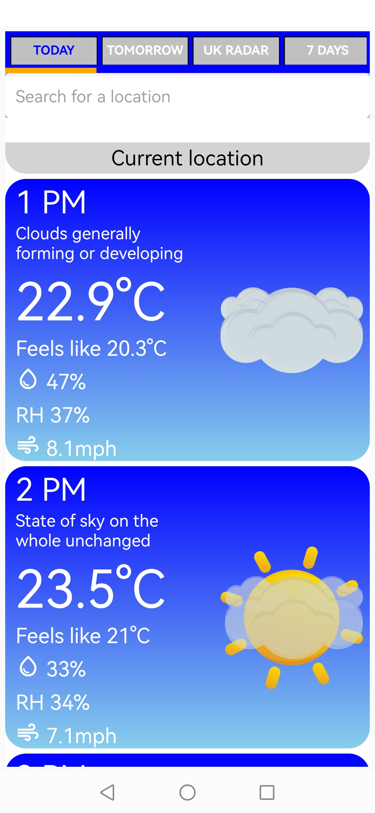
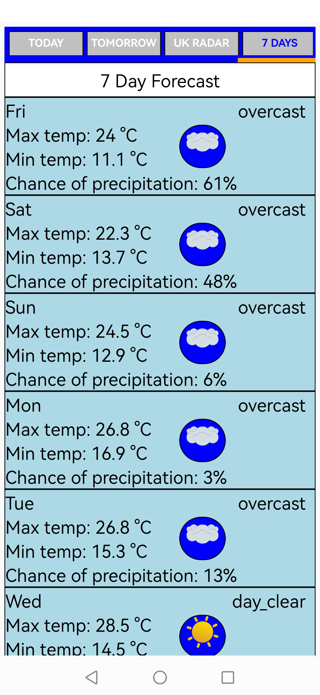
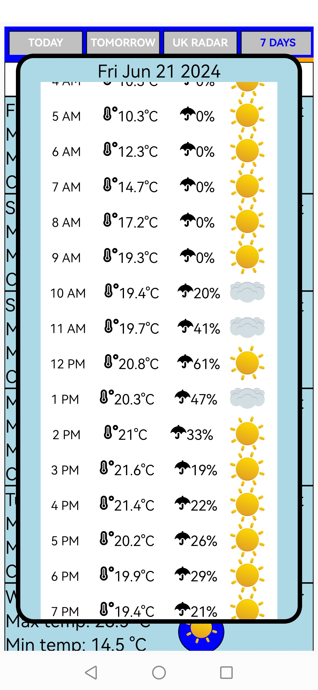
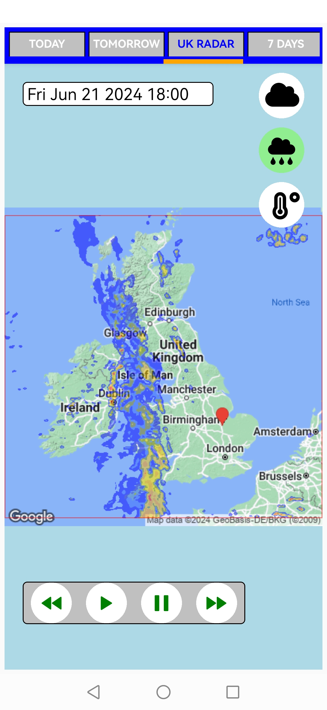
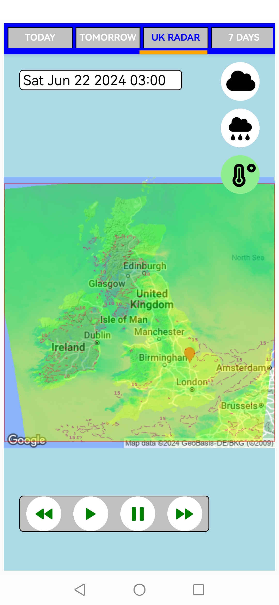
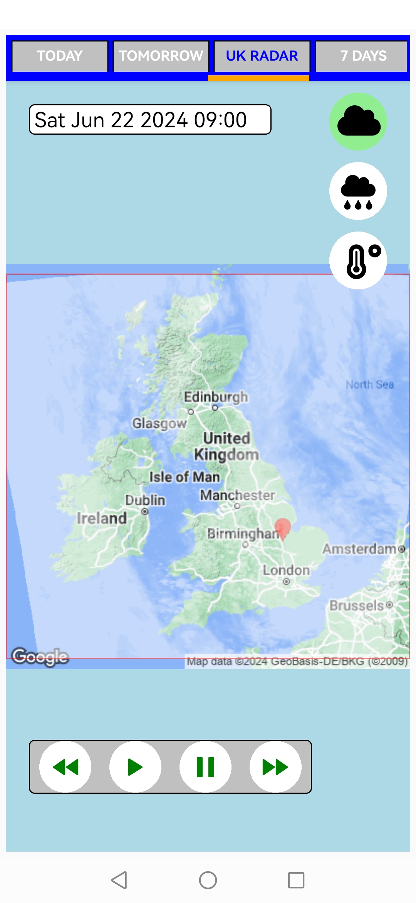

## ANDROID WEATHER


Uses met office radar data through a proxy server as the met office only use http (at time of writing)

Download apk


## google places api key needed
store in .env API_KEY='your_api_key'

Project written using [expo](https://docs.expo.dev/), [React Native](https://reactnative.dev/)

Built using [EAS Build](https://docs.expo.dev/build/introduction/)

[setup eas-cli](https://docs.expo.dev/build/setup/)

clone repo,
``````
git clone https://github.com/Chris-Mark-Wilson/android-weather.git
npm install
``````

run a build 
``````
eas build -p android --profile preview

warning issued on build for custom metro config - ignore, it will build and run

dont forget to add the .env api key to secrets in expo login

